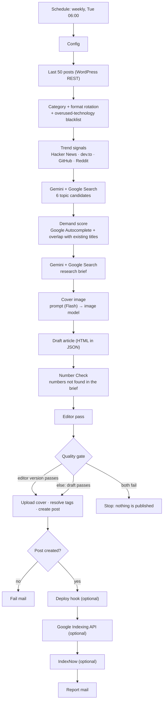

# n8n Grounded Blog Writer

**An n8n WordPress blogger that does its homework: real trend signals, a search-demand check, Google-grounded research, and a number checker that catches invented statistics.**

[Türkçe README](README.tr.md)


Once a week it picks a topic people are actually searching for, researches it with Google Search grounding, writes a long-form HTML article, strips out any number the research can't back up, and publishes it to WordPress with a generated cover image, tags and a clean slug. Then it pings search engines and emails you a report.

---

## Why this exists

Most "AI blog autopilot" workflows ask an LLM for a topic and publish whatever comes back. That fails in two predictable ways. This workflow hit both in production and was rebuilt around them:

1. **Topics nobody searches for.** The previous version picked topics that sounded clever but were too niche, so nobody typed them into Google. **Fix:** it now reads real trend signals (Hacker News, dev.to, GitHub, Reddit) and scores every candidate topic with Google Autocomplete before a single word is written.
2. **Stale facts and invented statistics.** Articles weren't current, and the model made up numbers ("cuts latency by 43%"). **Fix:** it now writes from a **Google-Search-grounded research brief**. A deterministic **Number Check** flags every number the brief doesn't contain, an **editor pass** has to remove those numbers, and a **quality gate** won't publish if any survive.

This is v5 of a pipeline that runs weekly in production on a real technical blog, cleaned up for public use: no private services, secrets live in n8n credentials, and everything user-specific sits in one `Config` node.

## How it works



1. **Context.** Fetches your last 50 posts. The week of the year selects a focus **category** and an article **format**. Technologies that dominated the last 14 days of titles go on a "don't make this the main topic" blacklist.
2. **Trend signals.** Pulls the past week's top stories from Hacker News (above a points threshold), dev.to top articles, the fastest-starred new GitHub repos and top Reddit posts. Any source that fails is skipped.
3. **Topic candidates (grounded).** Gemini, with the Google Search tool enabled, proposes 6 candidates: 3 from the focus category and 3 from the trends. Each has a focus keyword, a title, a "why now" and a trend score (1–5).
4. **Demand score.** For each candidate it queries Google Autocomplete twice (the full keyword, then its head term) and scores exact completion, matching suggestions and breadth, plus the trend score. Candidates whose titles overlap 60 % or more with an existing post get a heavy penalty. The best score wins.
5. **Research brief (grounded).** A second grounded call produces a 700–1100 word brief: current versions and dates, exact API names, reader questions, what competing articles miss, pitfalls, **verified numbers with sources** and official URLs.
6. **Cover image.** Gemini Flash writes a specific editorial image prompt, and a Gemini image model renders a 16:9 cover.
7. **Draft → Number Check → Editor.** The writer model drafts the article from the brief. The Number Check lists unsourced numbers, and the editor model fixes accuracy, search intent, depth and style, and must remove those numbers.
8. **Quality gate.** It checks the editor's version first and falls back to the draft. Checks: title/excerpt length, minimum words, at least one code block, at least 4 `<h2>` sections, no unsafe HTML, no invented personal experience, **no unsourced numbers**, and no invented metric in the title. If neither version passes, the run stops.
9. **Publish.** Uploads the cover to the media library (with alt text), gets or creates the tags, then creates the post with a short keyword slug, tags and featured image, all through the WordPress REST API.
10. **Index + report.** Optionally triggers a deploy hook for headless frontends, then optionally pings the Google Indexing API and IndexNow. Finally it mails a report with the chosen topic, demand score, the scores of every candidate, word count, warnings, research sources and indexing status.

## Features

- **Demand-first topic selection**: real trend inputs plus a Google Autocomplete demand score and a duplicate-topic penalty.
- **Grounded research**: two Gemini calls with Google Search grounding, one for topics and one for the brief, so versions and dates are current.
- **Number Check**: catches percentages, durations, multipliers and thousands-formatted numbers that don't appear in the research. [Details below](#the-number-check).
- **Editor pass + quality gate** with a draft fallback, so one bad editor output doesn't cost you the week.
- **Weekly rotation** across 14 categories × 7 formats, plus an "overused technology" blacklist.
- **Internal linking**: the writer gets your recent posts (with public URLs) and links 2–3 that are actually related.
- **SEO basics built in**: focus keyword placement, 140–160 character excerpt, short ASCII slug, FAQ section, table of contents with anchors, alt text on the cover.
- **Headless-friendly**: rewrites WordPress links to your public URL base, plus an optional deploy hook.
- **Indexing**: optional Google Indexing API and IndexNow pings. A companion workflow re-submits only the URLs that are **not indexed yet**.
- **Any output language**: prompts are in English, and the output language, locale and Autocomplete region are all Config values. A Turkish example config is included.
- **No secrets in nodes**: Gemini, WordPress, SMTP and the Google service account all live in n8n credentials.

## What's in this repo

| Path | What it is |
|---|---|
| `workflows/grounded-blog-writer.json` | The main weekly workflow (38 nodes + setup notes on the canvas). |
| `workflows/wp-indexer-smart.json` | Companion: inspects every published post with the Search Console URL Inspection API and submits only non-indexed URLs. |
| `workflows/error-notifier.json` | Optional 3-node error workflow that emails you when a run fails hard. |
| `examples/config.example.json` | The default `Config` (same as in the workflow), easier to read and diff. |
| `examples/config.turkish.example.json` | The same config set up for a Turkish-language blog (language, locale, Autocomplete region, banned phrases). |
| `examples/number-check-sample.json` + `scripts/number-check-demo.js` | Runs the workflow's own Number Check code outside n8n: `node scripts/number-check-demo.js`. |

## Requirements

- **Self-hosted n8n 2.x.** It was built and runs on the official `n8nio/n8n` Docker image. It uses only core nodes (Code, HTTP Request, Convert to File, IF, Basic LLM Chain, Google Gemini Chat Model, Send Email) and needs **no** extra environment variables or `NODE_FUNCTION_ALLOW_BUILTIN` modules.
- **A Gemini API key** (Google AI Studio) that can use the models in `Config`: text models, **Google Search grounding**, and an **image-output** model. Grounding and image generation may need a paid tier. Check the current Gemini pricing and quotas for your account.
- **WordPress 5.6 or newer** with the REST API reachable from n8n, and a user with an **Application Password**. Editor or Administrator is recommended because the user must publish posts, upload media and create tags. By default WordPress only offers Application Passwords on HTTPS sites.
- **An SMTP account** for the report mails.
- *Optional:* a Google Cloud **service account** that is an **Owner** of your Search Console property (for the Indexing API and URL Inspection), an **IndexNow** key file hosted on your site, and a **deploy hook** URL if you run a headless frontend.

## Quick start

1. **Import.** In n8n, go to *Workflows → Import from File* and choose `workflows/grounded-blog-writer.json`. Optionally import the indexer and the error notifier too.
2. **Create the credentials** (table below) and select them on every node that shows a credential warning.
3. **Edit the `Config` node** (second node). At minimum set `wp_site_url`, `language`, `audience`, `mail_from`, `mail_to`, and your `categories`.
4. **Test safely.** Set `"post_status": "draft"` and click *Execute workflow*. A run takes several minutes (two grounded calls, three long LLM calls, one image). Read the report mail and the draft in WordPress, then delete the test draft, its media and any new tags.
5. **Go live.** Switch `post_status` back to `publish`, set the workflow timezone (*Settings → Timezone*, or `GENERIC_TIMEZONE` on the instance), and **activate**. It runs every **Tuesday at 06:00**. Change the cron in *Schedule Trigger* if you like.
6. *Recommended:* import `error-notifier.json`, then in the blog workflow's *Settings → Error workflow* select it. Hard failures such as "quality gate failed" then reach your inbox.

### Credentials

| n8n credential type | Used by | How to get it |
|---|---|---|
| **Google Gemini(PaLM) API** (`googlePalmApi`) | Gemini Flash (Image Prompt), Gemini Pro (Content), Gemini Pro (Editor), Topic Candidates (Grounded), Research Brief (Grounded), Generate Cover Image | Create an API key in Google AI Studio. |
| **Basic Auth** (`httpBasicAuth`) | Fetch Last 50 Posts, Upload Featured Image, Get or Create Tag, Create Post (and *Fetch All Posts* in the indexer) | User = your WordPress **username**. Password = an **Application Password** from *Users → Profile → Application Passwords*, **not** your login password. |
| **SMTP** (`smtp`) | Send Success Mail, Send Fail Mail (and the indexer / error mails) | Your mail provider's SMTP host, port, user and password. |
| **Google Service Account API** (`googleApi`) *(optional)* | Google Indexing API (and *Inspect URL* + *Google Indexing API* in the indexer) | Create a service account and a JSON key. Paste the `client_email` and `private_key`, turn on **"Set up for use in HTTP Request node"**, and set scopes to `https://www.googleapis.com/auth/indexing, https://www.googleapis.com/auth/webmasters.readonly`. Enable the *Web Search Indexing API* and *Google Search Console API* in the Cloud project, and add the service-account email as an **Owner** of the Search Console property. |

> Why generic Basic Auth instead of n8n's WordPress credential? The workflow needs endpoints the WordPress node doesn't cover (binary media upload, tag creation, `featured_media`), so every WordPress call is a plain HTTP Request, and Basic Auth with an Application Password is the most portable way to authenticate them.

### Config

Everything user-specific is in the `Config` node (raw JSON). [`examples/config.example.json`](examples/config.example.json) contains the same defaults.

| Key | Default | Meaning |
|---|---|---|
| `wp_site_url` | `https://your-site.example.com` | WordPress base URL. The REST API is expected at `/wp-json`. |
| `public_url_base` | `""` | For headless setups: the public base URL of your posts, e.g. `https://www.example.com/blog`. WordPress links that start with `wp_site_url` are rewritten to it for internal links and indexing. Empty = use WordPress links as they are. |
| `post_status` | `publish` | `publish` or `draft`. Drafts skip the Google and IndexNow pings. |
| `wp_category_ids` | `[]` | WordPress category IDs to assign. Empty = the WordPress default category. |
| `language` | `English` | Output language for the research brief, article, title, excerpt and tags. |
| `locale` | `en-US` | Used for lower-casing and keyword matching. `tr-TR` matters for Turkish I/ı. |
| `audience` | `software developers` | Who the blog is for. Injected into every prompt. |
| `autocomplete_hl` / `autocomplete_gl` | `en` / `us` | Google Autocomplete language and country for the demand check. |
| `keyword_examples` | 5 examples | Realistic focus keywords shown to the topic model. Write them in your output language. |
| `banned_phrases` | English clichés | Phrases the writer and the editor must avoid ("in this article", "game-changing", …). |
| `fake_experience_patterns` | 3 phrases | Literal, case-insensitive phrases that make the quality gate reject a text (invented personal experience). |
| `require_code_example` | `true` | Quality gate requires at least one `<pre><code>` block. Set `false` for non-technical niches (the writing prompt adapts too). |
| `target_words_min` / `target_words_max` | `1800` / `2800` | Length requested from the writer and the editor. |
| `gate_min_words` | `1200` | Hard minimum enforced by the quality gate. |
| `overused_window_days` | `14` | Look-back window for the overused-technology blacklist. |
| `model_research` | `gemini-pro-latest` | Grounded topic brainstorm + research brief (REST `v1beta`, `google_search` tool). |
| `model_writer` | `gemini-pro-latest` | Draft and editor pass (up to 32k output tokens, temperature 0.6). |
| `model_image_prompt` | `gemini-3-flash-preview` | Writes the cover image prompt. |
| `model_image` | `gemini-3.1-flash-image` | Renders the 16:9 cover (`generateContent` with the `IMAGE` modality, REST `v1`). |
| `trend_sources` | all enabled | `hackernews.min_points` (150), `devto.tag` (e.g. `python`), `github.extra_query` (e.g. `language:rust`), `reddit.subreddits` (`["programming"]`). Set `enabled: false` to skip a source. |
| `http_user_agent` | `Mozilla/5.0 (compatible; n8n-blog-bot/1.0)` | User-Agent for the trend source requests. Reddit prefers a descriptive one. |
| `categories` | 14 tech categories (A–N) | `{code, name, topics}`, rotated weekly. **Edit these for your niche.** |
| `formats` | 7 formats | `{code, name, description, guide}`, rotated weekly. The topic model may choose a different format by its exact name. |
| `google_indexing_enabled` | `false` | Ping the Google Indexing API after publishing. Needs the service-account credential. See the [note below](#a-note-on-the-google-indexing-api). |
| `indexnow_key` | `""` | Your IndexNow key. Empty = skip IndexNow. |
| `indexnow_key_location` | `""` | URL of the key file. Empty = `https://<public host>/<key>.txt`. |
| `deploy_hook_url` | `""` | POSTed after publishing (a Vercel, Netlify or Cloudflare Pages deploy hook, …). Empty = skip. |
| `mail_from` / `mail_to` | `blog-bot@example.com` / `you@example.com` | Report mail sender and recipient. |

The default categories and formats are a generic software-engineering setup (AI coding agents, ML engineering, backend, frontend, mobile, databases, data engineering, DevOps, Kubernetes, security, architecture, performance, testing). Treat them as an example and edit them to your niche.

## The Number Check

LLMs are very good at producing believable numbers. Telling them "don't invent statistics" helps less than you'd hope. So the pipeline adds a cheap, deterministic check between the draft and the editor, and runs it again inside the quality gate.

**How it works**

1. Collect every number in the research brief and normalize it to digits only, so `10,000`, `10.000` and `10000` all become `10000`.
2. Scan the draft (outside `<pre>`/`<code>` blocks) for *claim-shaped* numbers:

   | Pattern | Examples (English and Turkish units) |
   |---|---|
   | Percentages | `45%`, `%45`, `45 percent` |
   | Durations | `120 ms`, `250 milliseconds`, `1.5 seconds`, `milisaniye`, `saniye` |
   | Multipliers | `3x`, `7 times`, `2 kat` |
   | Thousands-formatted numbers | `12,500`, `12.500` |

3. Any match whose digits are not in the brief's set is **unsourced**. The editor receives the list with orders to remove each one or rephrase it without a number (a flagged value in a table row means the whole row goes). The quality gate repeats the check on the final text, and if an unsourced number is still there, that version is rejected.

**A tiny example** (this is [`examples/number-check-sample.json`](examples/number-check-sample.json)):

Research brief:
```text
- PostgreSQL 17 was released on 2024-09-26.
- Vendor benchmark (source: vendor blog): index-only scans were 3x faster on the test dataset.
- Developer survey (source: survey report): 10,000 respondents, 62% use PostgreSQL.
```

Draft:
```html
<p>Covering indexes made queries 3x faster and cut p99 latency by 45% to 120 ms.</p>
<p>According to a survey of 10.000 developers, 62 percent already use it,
   and teams report a 7 times smaller I/O footprint.</p>
```

```console
$ node scripts/number-check-demo.js
Numbers NOT backed by the brief (the editor must remove or rephrase them):
  - 45%
  - 120 ms
  - 7 times
```

`3x`, `10.000` (= `10,000`) and `62 percent` pass because the brief contains them. The editor would typically rewrite the first sentence as *"Covering indexes made queries 3x faster and noticeably reduced p99 latency."*

**What it is not.** It is a net, not a fact-checker. It only checks that the digits appear *somewhere* in the brief, not that they're used in the same context, so small numbers like `2x` can slip through when the brief happens to contain a "2". Plain numbers without a unit (versions, years, counts) aren't checked at all. To support more languages, extend the unit list in **both** the *Number Check* and *Quality Gate* nodes (they share the same regex).

## Cost

We don't quote prices because Gemini pricing changes. Per run, these are the cost drivers:

- **2 grounded calls** (`model_research`): topic brainstorm and research brief. On many models, Google Search grounding is billed separately from tokens.
- **3 LLM calls without grounding**: image prompt (Flash, small), draft (Pro, long output), editor pass (Pro). The editor's input contains the brief plus the full draft, and it rewrites the whole article.
- **1 image generation** (`model_image`, 1K, 16:9).
- **Retries**: the grounded calls retry up to 3 times, and the LLM chains and image call also retry on failure, so a bad day can cost more than a normal one.
- **Free, but rate-limited**: up to 16 Google Autocomplete requests, the Hacker News, dev.to, GitHub and Reddit public APIs, WordPress, IndexNow, and the Google Indexing / URL Inspection APIs (quota-limited, not billed).

At one run per week that's roughly 4–5 runs a month. Check the current pricing for the models you set in `Config`.

## Lessons learned in production

- **Niche topics get zero traffic.** The previous version's topics were technically interesting and nobody searched for them. Trend inputs plus an Autocomplete demand score fixed topic selection more than any prompt tweak did. The scoring is simple on purpose: exact completion +4, +1 per suggestion that contains every keyword token, +0.3 per suggestion for the head term, +1.2 × trend score, and −20 when the title overlaps an existing post by 60 % or more.
- **"Don't invent numbers" isn't enough.** Prompt rules alone didn't stop made-up statistics. What worked was layering: grounded brief → deterministic Number Check → editor told exactly which numbers to remove → quality gate that re-checks.
- **Ground both the topic step and the research step.** Without Google Search grounding the model confidently presented old versions and product names as current. Both grounded prompts now explicitly say "if your knowledge is outdated, update it with search".
- **Weekly rotation math is easy to get wrong.** A day-of-year index taken modulo 14 categories, run once a week, only ever visits 2 categories because 7 and 14 share a factor. Rotation now uses the week index.
- **The editor pass can make things worse.** It can break the JSON, shorten the article, or reintroduce numbers. That's why the gate tries the editor's version, then the original draft, and only then gives up.
- **Models get stuck on the current hype.** Without the 14-day "overused technologies" blacklist, several consecutive posts orbit the same hot tool.
- **Headless WordPress: index the public URL, not the WordPress URL.** The WordPress `link` points at the CMS host. `public_url_base` rewrites it for internal links, Google and IndexNow.
- **Test with drafts.** Run a copy with `post_status: "draft"`, then delete the draft, its media and any new tags. It's cheap insurance before activating.
- **Public trend APIs are flaky.** Rate limits and blocked datacenter IPs happen, so every trend source is optional and fails silently. If all of them fail, the grounded topic prompt still works.

## A note on the Google Indexing API

Google documents the Indexing API for pages with `JobPosting` or `BroadcastEvent` (livestream) structured data. Using it for ordinary blog posts is outside that documented use and may simply be ignored. That's why it's **off by default** (`google_indexing_enabled: false`). IndexNow (used by Bing, Yandex and others) is designed for any URL.

## Companion workflow: WP Indexer Smart

`workflows/wp-indexer-smart.json` is a manually triggered workflow that:

1. Fetches **all** published posts (paginated WordPress REST) and converts them to public URLs (newest first, capped at `max_inspect_per_run`).
2. Checks each URL with the **Search Console URL Inspection API**.
3. Skips URLs whose verdict is `PASS`/`PARTIAL` and sends only the **not-indexed** ones to the Google Indexing API, plus IndexNow if a key is set.
4. Waits 1 s between URLs and emails a report: counts, the first 20 non-indexed URLs with their coverage state, and the first 30 errors.

Google's default quotas are **2,000 URL Inspection requests per day per property** and **200 Indexing API publish requests per day**. The workflow only spends Indexing quota on URLs that actually need it.

| Config key | Default | Meaning |
|---|---|---|
| `wp_site_url` | `https://your-site.example.com` | WordPress base URL. |
| `public_url_base` | `""` | Same as in the main workflow. |
| `search_console_property` | `sc-domain:your-site.example.com` | Your Search Console property: `sc-domain:example.com` for a domain property, `https://example.com/` for a URL-prefix property. |
| `max_inspect_per_run` | `200` | How many of the newest posts to inspect per run. |
| `indexnow_key` / `indexnow_key_location` | `""` | Same as in the main workflow. Empty key = no IndexNow. |
| `mail_from` / `mail_to` | example addresses | Report mail. |

## Troubleshooting / FAQ

**WordPress nodes return 401 `rest_not_logged_in` / `invalid_username`.**
Use an Application Password, not your login password. Some Apache/CGI setups strip the `Authorization` header. Adding `SetEnvIf Authorization "(.*)" HTTP_AUTHORIZATION=$1` to `.htaccess` is the usual fix. Security plugins that lock down the REST API also need an exception.

**The run stopped with `Quality gate: editor: … | draft: …`.**
Neither version passed. The message says why: for example `unsourced numeric claim: 45%`, `content too short (980 words)`, or `could not parse JSON`. Nothing was published. Re-running usually works. If one rule keeps failing for your niche, adjust `gate_min_words`, `require_code_example` or the patterns.

**`Research brief too short or empty` / `Could not parse topic candidates`.**
The grounded call returned nothing useful (quota, safety block, or non-JSON output). The HTTP nodes already retry 3 times. Check your Gemini quota, and check that grounding is available for `model_research`.

**`No image found in the Gemini response`.**
`model_image` didn't return an image, either because it's unavailable for your key or region or because the prompt was blocked. Try another image-capable model in `Config`.

**The report says "featured image upload failed".**
The post was published without a cover. Common causes are the upload size limit (413) or a security plugin blocking media uploads through REST.

**Google Indexing API: HTTP 403.**
Check four things: the service account is an **Owner** in Search Console, the Indexing API is enabled in the Cloud project, the credential has **"Set up for use in HTTP Request node"** turned on, and the scope is set.

**IndexNow: HTTP 403 / 422.**
The key file isn't reachable at `indexnow_key_location`, or the URL host doesn't match. The host is taken from the public post URL.

**Every demand score is ~0.**
Google Autocomplete (an unofficial endpoint) may be rate-limiting your server or may have changed. The run still works, but the trend score then decides alone.

**It ran at the wrong hour.**
The cron uses the workflow timezone. Set it in *Settings → Timezone* or via `GENERIC_TIMEZONE`.

**Headless site: Google hits a 404 right after publishing.**
The deploy hook is triggered before the indexing pings, but the workflow doesn't wait for your build to finish. If your builds are slow, add a Wait node between *Trigger Deploy Hook* and *Compute Public URL*.

## Customizing

- **Niche:** `categories`, `formats`, `audience`, `keyword_examples`, `trend_sources`, and `require_code_example: false` for non-code topics.
- **Language:** `language`, `locale`, `autocomplete_hl`/`autocomplete_gl`, `banned_phrases`, `fake_experience_patterns`. [`examples/config.turkish.example.json`](examples/config.turkish.example.json) shows a complete non-English setup.
- **Prompts** live in the nodes and are meant to be edited: *Build Topic Prompt* (topic brainstorm), *Pick Topic* (research brief prompt + scoring), *Write Image Prompt* (visual style and the per-category image guidance), *Generate Content*, *Editor Revision*.
- **Schedule:** the cron in *Schedule Trigger* (`0 6 * * 2`).

## Limitations

- Prompts, formats and quality rules are tuned for **technical** articles. Other niches work, but expect to edit prompts.
- Word counts split on whitespace, so languages without spaces (Chinese, Japanese, …) need a different counter in the quality gate.
- The Number Check is a heuristic (see above). It reduces invented statistics. It doesn't prove correctness.
- Google Autocomplete is a demand *proxy*, not search volume.
- One post per run, with no human-in-the-loop step. Use `post_status: "draft"` if you want to review before publishing.

## Contributing

Issues and pull requests are welcome, especially unit lists for more languages in the Number Check, better demand heuristics, and prompt improvements for non-technical niches. Please never commit a workflow export that still contains credentials or your own URLs, and keep personal copies as `*.local.json` (already git-ignored).

## Related

Other n8n workflows from the same production setup:

- [n8n-instagram-autopilot](https://github.com/bugraskl/n8n-instagram-autopilot): food photos → judged, designed Instagram posts, stories and a weekly AI reel
- [n8n-instagram-reels-publisher](https://github.com/bugraskl/n8n-instagram-reels-publisher): publish Instagram Reels from n8n with resumable upload
- [n8n-gmail-ai-labeler](https://github.com/bugraskl/n8n-gmail-ai-labeler): hourly Gmail labeling with a typed decision model

## License

[MIT](LICENSE)
