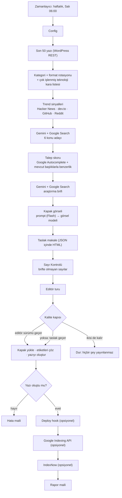

# n8n Grounded Blog Writer

**Ödevini yapan bir n8n WordPress yazarı: gerçek trend sinyalleri, arama talebi kontrolü, Google ile doğrulanmış araştırma ve uydurma istatistikleri yakalayan bir sayı kontrolü.**

[English README](README.md)


Haftada bir, insanların gerçekten aradığı bir konu seçer. Konuyu Google Search grounding ile araştırır ve uzun bir HTML makale yazar. Araştırmanın desteklemediği her sayıyı metinden ayıklar. Sonra yazıyı üretilmiş kapak görseli, etiketler ve temiz bir slug ile WordPress'te yayınlar. Son olarak arama motorlarına haber verir ve sana bir rapor maili gönderir.

---

## Neden var?

"Yapay zekâ blog otopilotu" akışlarının çoğu LLM'den bir konu ister ve dönen her şeyi yayınlar. Bu iki tahmin edilebilir şekilde çöker. Bu akış ikisini de canlıda yaşadı ve bu iki soruna göre yeniden kuruldu:

1. **Kimsenin aramadığı konular.** Önceki sürüm kulağa zekice gelen ama fazla niş konular seçiyordu. Bunları kimse Google'a yazmıyordu. **Çözüm:** Artık gerçek trend sinyallerini okuyor (Hacker News, dev.to, GitHub, Reddit) ve tek kelime yazmadan önce her konu adayını Google Autocomplete ile puanlıyor.
2. **Eskimiş bilgi ve uydurma istatistikler.** Yazılar güncel değildi ve model rakam uyduruyordu ("gecikmeyi %43 azaltır"). **Çözüm:** Yazı artık **Google Search ile doğrulanmış (grounded) bir araştırma brifinden** yazılıyor. Deterministik bir **Sayı Kontrolü**, brifte geçmeyen her sayıyı işaretliyor. **Editör turu** bu sayıları çıkarmak zorunda. Bir sayı yine de hayatta kalırsa **kalite kapısı** yayını durduruyor.

Bu, gerçek bir teknik blogda haftalık olarak canlıda çalışan bir akışın 5. sürümü. Herkesin kullanabileceği hâle getirildi: özel servis bağımlılığı yok, sırlar n8n credential'larında duruyor ve kullanıcıya özgü her şey tek bir `Config` düğümünde.

## Nasıl çalışır?



1. **Bağlam.** Son 50 yazını çeker. Yılın kaçıncı haftası olduğuna göre bir odak **kategori** ve bir makale **formatı** seçilir. Son 14 günün başlıklarında öne çıkan teknolojiler "bunu ana konu yapma" kara listesine girer.
2. **Trend sinyalleri.** Son haftanın öne çıkanlarını toplar: Hacker News'te belirli puanın üstündeki hikâyeler, dev.to'nun en iyi yazıları, en hızlı yıldız toplayan yeni GitHub repoları ve Reddit'in en popüler gönderileri. Hata veren kaynak atlanır.
3. **Konu adayları (grounded).** Google Search aracı açık olan Gemini 6 aday önerir: 3'ü odak kategoriden, 3'ü trendlerden. Her adayın bir anahtar kelimesi, başlığı, "neden şimdi" açıklaması ve 1–5 arası trend skoru vardır.
4. **Talep skoru.** Her aday için Google Autocomplete iki kez sorgulanır: önce anahtar kelimenin tamamı, sonra baş terimi. Tam tamamlama, eşleşen öneriler ve genişlik puanlanır, trend skoru da eklenir. Başlığı mevcut bir yazıyla %60 veya daha fazla örtüşen aday ağır ceza alır. En yüksek skor kazanır.
5. **Araştırma brifi (grounded).** İkinci bir grounded çağrı 700–1100 kelimelik bir brif üretir: güncel sürümler ve tarihler, doğru API adları, okur soruları, rakip yazıların atladığı açılar, tuzaklar, **kaynaklı doğrulanmış sayılar** ve resmi URL'ler.
6. **Kapak görseli.** Gemini Flash konuya özgü, editoryal bir görsel promptu yazar. Bir Gemini görsel modeli bu prompttan 16:9 kapağı üretir.
7. **Taslak → Sayı Kontrolü → Editör.** Yazar modeli makaleyi brife dayanarak yazar. Sayı Kontrolü kaynaksız sayıları listeler. Editör modeli doğruluk, arama niyeti, derinlik ve üslubu düzeltir ve listedeki sayıları çıkarmak zorundadır.
8. **Kalite kapısı.** Önce editör sürümünü dener, olmazsa taslağa düşer. Kontroller: başlık ve özet uzunluğu, minimum kelime sayısı, en az bir kod bloğu, en az 4 `<h2>`, güvensiz HTML olmaması, uydurma kişisel deneyim olmaması, **kaynaksız sayı olmaması** ve başlıkta uydurma metrik olmaması. İki sürüm de geçemezse çalışma durur.
9. **Yayın.** Kapağı alt metniyle medya kütüphanesine yükler, etiketleri bulur ya da oluşturur, sonra yazıyı kısa bir anahtar kelime slug'ı, etiketler ve öne çıkan görselle oluşturur. Bunların hepsi WordPress REST API üzerinden yapılır.
10. **İndeksleme ve rapor.** İsteğe bağlı olarak headless frontend için bir deploy hook tetikler, sonra Google Indexing API ve IndexNow'a haber verir. En sonda bir rapor maili atar: seçilen konu, talep skoru, tüm adayların skorları, kelime sayısı, uyarılar, araştırma kaynakları ve indeksleme durumu.

## Özellikler

- **Önce talep, sonra konu.** Gerçek trend girdileri, Google Autocomplete talep skoru ve tekrar eden konu cezası.
- **Grounded araştırma.** Google Search grounding ile iki Gemini çağrısı yapılır: biri konu için, biri brif için. Böylece sürümler ve tarihler güncel olur.
- **Sayı Kontrolü.** Araştırmada geçmeyen yüzdeleri, süreleri, katları ve binlik ayraçlı sayıları yakalar. [Ayrıntılar aşağıda](#sayı-kontrolü).
- **Editör turu + kalite kapısı.** Taslak yedeği sayesinde tek bir kötü editör çıktısı o haftanın yazısını çöpe atmaz.
- **Haftalık rotasyon.** 14 kategori × 7 format ve "çok işlenmiş teknoloji" kara listesi.
- **İç linkleme.** Yazar son yazılarını (public URL'leriyle) görür ve gerçekten ilgili 2–3 tanesine link verir.
- **Temel SEO hazır.** Anahtar kelime yerleşimi, 140–160 karakterlik özet, kısa ASCII slug, SSS bölümü, çapalı içindekiler ve kapakta alt metin.
- **Headless uyumlu.** WordPress linklerini public URL tabanına çevirir ve opsiyonel bir deploy hook tetikler.
- **İndeksleme.** Opsiyonel Google Indexing API ve IndexNow bildirimleri. Yardımcı bir akış yalnızca **henüz indekslenmemiş** URL'leri yeniden gönderir.
- **Her çıktı dili.** Promptlar İngilizce. Çıktı dili, locale ve Autocomplete bölgesi Config değerleridir. Türkçe örnek config dahildir.
- **Düğümlerde sır yok.** Gemini, WordPress, SMTP ve Google servis hesabı n8n credential'larında durur.

## Repoda neler var?

| Yol | Ne işe yarar |
|---|---|
| `workflows/grounded-blog-writer.json` | Ana haftalık akış (38 düğüm + canvas üzerinde kurulum notları). |
| `workflows/wp-indexer-smart.json` | Yardımcı akış: yayındaki her yazıyı Search Console URL Inspection API ile kontrol eder ve sadece indekslenmemiş olanları gönderir. |
| `workflows/error-notifier.json` | Opsiyonel, 3 düğümlük hata akışı. Bir çalışma sert şekilde çökerse mail atar. |
| `examples/config.example.json` | Varsayılan `Config` (akıştakiyle aynı), okuması ve karşılaştırması daha kolay. |
| `examples/config.turkish.example.json` | Aynı config'in Türkçe blog için hazırlanmış hâli (dil, locale, Autocomplete bölgesi, yasaklı kalıplar). |
| `examples/number-check-sample.json` + `scripts/number-check-demo.js` | Akışın kendi Sayı Kontrolü kodunu n8n dışında çalıştırır: `node scripts/number-check-demo.js`. |

## Gereksinimler

- **Self-hosted n8n 2.x.** Resmî `n8nio/n8n` Docker imajında geliştirildi ve orada çalışıyor. Yalnızca çekirdek düğümleri kullanır (Code, HTTP Request, Convert to File, IF, Basic LLM Chain, Google Gemini Chat Model, Send Email). Ek ortam değişkeni ya da `NODE_FUNCTION_ALLOW_BUILTIN` modülü **gerekmez**.
- **Bir Gemini API anahtarı** (Google AI Studio). `Config`'teki modellere erişebilmeli: metin modelleri, **Google Search grounding** ve **görsel çıktı** veren bir model. Grounding ve görsel üretim ücretli katman gerektirebilir. Hesabının güncel Gemini fiyatlarına ve kotalarına bak.
- **WordPress 5.6 veya üstü.** REST API n8n'den erişilebilir olmalı ve kullanıcının bir **Application Password**'ü olmalı. Kullanıcı yazı yayınlayacağı, medya yükleyeceği ve etiket oluşturacağı için Editor veya Administrator önerilir. WordPress, Application Password'ı varsayılan olarak yalnızca HTTPS sitelerde sunar.
- **Bir SMTP hesabı** (rapor mailleri için).
- *Opsiyonel:* Search Console mülkünde **Owner** olan bir Google Cloud **servis hesabı** (Indexing API ve URL Inspection için), sitende barındırılan bir **IndexNow** anahtar dosyası ve headless frontend kullanıyorsan bir **deploy hook** URL'si.

## Hızlı başlangıç

1. **İçe aktar.** n8n'de *Workflows → Import from File* ile `workflows/grounded-blog-writer.json` dosyasını seç. İstersen indeksleyici ile hata akışını da aktar.
2. **Credential'ları oluştur** (aşağıdaki tablo) ve credential uyarısı gösteren her düğümde seç.
3. **`Config` düğümünü düzenle** (ikinci düğüm). En azından `wp_site_url`, `language`, `audience`, `mail_from`, `mail_to` ve `categories` değerlerini ayarla.
4. **Güvenli test.** `"post_status": "draft"` yap ve *Execute workflow*'a bas. Bir çalışma birkaç dakika sürer (iki grounded çağrı, üç uzun LLM çağrısı, bir görsel). Rapor mailini ve WordPress'teki taslağı incele. Sonra test taslağını, medyasını ve yeni oluşan etiketleri sil.
5. **Canlıya al.** `post_status` değerini tekrar `publish` yap. Akışın saat dilimini ayarla (*Settings → Timezone* ya da instance'ta `GENERIC_TIMEZONE`) ve **aktifleştir**. Akış her **Salı 06:00**'da çalışır. İstersen *Schedule Trigger*'daki cron'u değiştir.
6. *Önerilir:* `error-notifier.json`'u içe aktar ve blog akışında *Settings → Error workflow* altında onu seç. "Kalite kapısı geçilemedi" gibi sert hatalar böylece gelen kutuna düşer.

### Credential'lar

| n8n credential tipi | Kullanan düğümler | Nasıl alınır |
|---|---|---|
| **Google Gemini(PaLM) API** (`googlePalmApi`) | Gemini Flash (Image Prompt), Gemini Pro (Content), Gemini Pro (Editor), Topic Candidates (Grounded), Research Brief (Grounded), Generate Cover Image | Google AI Studio'da bir API anahtarı oluştur. |
| **Basic Auth** (`httpBasicAuth`) | Fetch Last 50 Posts, Upload Featured Image, Get or Create Tag, Create Post (indeksleyicide *Fetch All Posts*) | Kullanıcı: WordPress **kullanıcı adın**. Parola: *Kullanıcılar → Profil → Application Passwords* altından alınan **Application Password**. Giriş parolan **değil**. |
| **SMTP** (`smtp`) | Send Success Mail, Send Fail Mail (indeksleyici ve hata mailleri) | Mail sağlayıcının SMTP sunucusu, portu, kullanıcısı ve parolası. |
| **Google Service Account API** (`googleApi`) *(opsiyonel)* | Google Indexing API (indeksleyicide *Inspect URL* + *Google Indexing API*) | Bir servis hesabı ve JSON anahtarı oluştur. `client_email` ile `private_key`'i yapıştır, **"Set up for use in HTTP Request node"** seçeneğini aç ve scope olarak `https://www.googleapis.com/auth/indexing, https://www.googleapis.com/auth/webmasters.readonly` gir. Cloud projesinde *Web Search Indexing API* ile *Google Search Console API*'yi etkinleştir ve servis hesabının e-postasını Search Console mülküne **Owner** olarak ekle. |

> Neden n8n'in WordPress credential'ı değil de genel Basic Auth? Akış, WordPress düğümünün kapsamadığı uç noktalara ihtiyaç duyuyor (binary medya yükleme, etiket oluşturma, `featured_media`). Bu yüzden her WordPress çağrısı sade bir HTTP Request, ve bunları doğrulamanın en taşınabilir yolu Application Password ile Basic Auth.

### Config

Kullanıcıya özgü her şey `Config` düğümünde (ham JSON). Aynı varsayılanlar [`examples/config.example.json`](examples/config.example.json) dosyasında da var.

| Anahtar | Varsayılan | Anlamı |
|---|---|---|
| `wp_site_url` | `https://your-site.example.com` | WordPress ana adresi. REST API'nin `/wp-json` altında olması beklenir. |
| `public_url_base` | `""` | Headless kurulumlar için yazıların public ana adresi, örn. `https://www.example.com/blog`. `wp_site_url` ile başlayan WordPress linkleri iç linkler ve indeksleme için bu adrese çevrilir. Boşsa WordPress linkleri olduğu gibi kullanılır. |
| `post_status` | `publish` | `publish` ya da `draft`. Taslaklar için Google ve IndexNow bildirimi yapılmaz. |
| `wp_category_ids` | `[]` | Atanacak WordPress kategori ID'leri. Boşsa WordPress'in varsayılan kategorisi kullanılır. |
| `language` | `English` | Araştırma brifi, makale, başlık, özet ve etiketlerin dili. Türkçe için `Turkish`. |
| `locale` | `en-US` | Küçük harfe çevirme ve anahtar kelime eşleştirme için. Türkçe I/ı için `tr-TR` önemli. |
| `audience` | `software developers` | Blogun hedef okuru. Tüm promptlara eklenir. |
| `autocomplete_hl` / `autocomplete_gl` | `en` / `us` | Talep kontrolünde kullanılan Google Autocomplete dili ve ülkesi. Türkiye için `tr` / `tr`. |
| `keyword_examples` | 5 örnek | Konu modeline gösterilen gerçekçi anahtar kelime örnekleri. Çıktı dilinde yaz. |
| `banned_phrases` | İngilizce klişeler | Yazar ve editörün kaçınması gereken kalıplar ("bu yazıda", "günümüzde"…). |
| `fake_experience_patterns` | 3 ifade | Kalite kapısının metni reddetmesine yol açan, büyük/küçük harf duyarsız sabit ifadeler (uydurma kişisel deneyim). |
| `require_code_example` | `true` | Kalite kapısı en az bir `<pre><code>` bloğu ister. Teknik olmayan nişler için `false` yap (yazım promptu da buna uyar). |
| `target_words_min` / `target_words_max` | `1800` / `2800` | Yazardan ve editörden istenen uzunluk. |
| `gate_min_words` | `1200` | Kalite kapısının kesin alt sınırı. |
| `overused_window_days` | `14` | "Çok işlenmiş teknoloji" kara listesinin geriye bakış penceresi. |
| `model_research` | `gemini-pro-latest` | Grounded konu beyin fırtınası ve araştırma brifi (REST `v1beta`, `google_search` aracı). |
| `model_writer` | `gemini-pro-latest` | Taslak ve editör turu (en fazla 32k çıktı token'ı, sıcaklık 0.6). |
| `model_image_prompt` | `gemini-3-flash-preview` | Kapak görseli promptunu yazar. |
| `model_image` | `gemini-3.1-flash-image` | 16:9 kapağı üretir (`IMAGE` modalitesiyle `generateContent`, REST `v1`). |
| `trend_sources` | hepsi açık | `hackernews.min_points` (150), `devto.tag` (örn. `python`), `github.extra_query` (örn. `language:rust`), `reddit.subreddits` (`["programming"]`). Bir kaynağı atlamak için `enabled: false` yap. |
| `http_user_agent` | `Mozilla/5.0 (compatible; n8n-blog-bot/1.0)` | Trend kaynağı istekleri için User-Agent. Reddit açıklayıcı bir UA tercih eder. |
| `categories` | 14 teknik kategori (A–N) | `{code, name, topics}` biçiminde, haftalık döner. **Kendi nişine göre düzenle.** |
| `formats` | 7 format | `{code, name, description, guide}` biçiminde, haftalık döner. Konu modeli tam adıyla başka bir format da seçebilir. |
| `google_indexing_enabled` | `false` | Yayından sonra Google Indexing API'ye bildirim gönderir. Servis hesabı credential'ı gerekir. [Aşağıdaki nota](#google-indexing-api-hakkında-bir-not) bak. |
| `indexnow_key` | `""` | IndexNow anahtarın. Boşsa IndexNow atlanır. |
| `indexnow_key_location` | `""` | Anahtar dosyasının URL'si. Boşsa `https://<public host>/<key>.txt` kullanılır. |
| `deploy_hook_url` | `""` | Yayından sonra POST edilir (Vercel, Netlify ya da Cloudflare Pages deploy hook'u vb.). Boşsa atlanır. |
| `mail_from` / `mail_to` | `blog-bot@example.com` / `you@example.com` | Rapor mailinin göndereni ve alıcısı. |

Varsayılan kategoriler ve formatlar genel bir yazılım mühendisliği kurulumudur (AI kodlama ajanları, ML mühendisliği, backend, frontend, mobil, veritabanları, veri mühendisliği, DevOps, Kubernetes, güvenlik, mimari, performans, test). Bunları bir örnek olarak gör ve kendi nişine göre düzenle.

## Sayı Kontrolü

LLM'ler inandırıcı sayılar üretmekte çok iyidir. Onlara "istatistik uydurma" demek beklenenden daha az işe yarar. Bu yüzden akış, taslak ile editör arasına ucuz ve deterministik bir kontrol ekler ve aynı kontrolü kalite kapısında bir kez daha çalıştırır.

**Nasıl çalışır?**

1. Araştırma brifindeki tüm sayılar toplanır ve yalnızca rakamlara indirgenir. Böylece `10,000`, `10.000` ve `10000` hepsi `10000` olur.
2. Taslak (`<pre>`/`<code>` blokları hariç) *iddia biçimli* sayılar için taranır:

   | Kalıp | Örnekler (İngilizce ve Türkçe birimler) |
   |---|---|
   | Yüzdeler | `45%`, `%45`, `45 percent` |
   | Süreler | `120 ms`, `250 milliseconds`, `1.5 seconds`, `milisaniye`, `saniye` |
   | Katlar | `3x`, `7 times`, `2 kat` |
   | Binlik ayraçlı sayılar | `12,500`, `12.500` |

3. Rakamları brifte bulunmayan her eşleşme **kaynaksız** sayılır. Editör bu listeyi alır ve her birini metinden çıkarmakla ya da sayısız, nitel bir ifadeye çevirmekle yükümlüdür (işaretli değer bir tablo satırındaysa satırın tamamı gider). Kalite kapısı aynı kontrolü son metinde tekrarlar. Kaynaksız bir sayı hâlâ duruyorsa o sürüm reddedilir.

**Küçük bir örnek** ([`examples/number-check-sample.json`](examples/number-check-sample.json)):

Araştırma brifi:
```text
- PostgreSQL 17 was released on 2024-09-26.
- Vendor benchmark (source: vendor blog): index-only scans were 3x faster on the test dataset.
- Developer survey (source: survey report): 10,000 respondents, 62% use PostgreSQL.
```

Taslak:
```html
<p>Covering indexes made queries 3x faster and cut p99 latency by 45% to 120 ms.</p>
<p>According to a survey of 10.000 developers, 62 percent already use it,
   and teams report a 7 times smaller I/O footprint.</p>
```

```console
$ node scripts/number-check-demo.js
Numbers NOT backed by the brief (the editor must remove or rephrase them):
  - 45%
  - 120 ms
  - 7 times
```

`3x`, `10.000` (= `10,000`) ve `62 percent` geçer, çünkü brifte varlar. Editör ilk cümleyi genelde *"Covering indexes made queries 3x faster and noticeably reduced p99 latency."* gibi yeniden yazar.

**Ne değildir?** Bir ağdır, doğruluk denetçisi değildir. Yalnızca rakamların brifte *bir yerde* geçip geçmediğine bakar, aynı bağlamda kullanılıp kullanılmadığına bakmaz. Bu yüzden `2x` gibi küçük sayılar, brifte tesadüfen bir "2" varsa geçebilir. Birimsiz düz sayılar (sürümler, yıllar, adetler) hiç kontrol edilmez. Başka diller eklemek için birim listesini **hem** *Number Check* **hem de** *Quality Gate* düğümünde genişlet (ikisi aynı regex'i kullanır).

## Maliyet

Gemini fiyatları değiştiği için rakam vermiyoruz. Her çalışmada maliyeti şunlar belirler:

- **2 grounded çağrı** (`model_research`): konu beyin fırtınası ve araştırma brifi. Birçok modelde Google Search grounding, token'lardan ayrı faturalanır.
- **Grounding'siz 3 LLM çağrısı**: görsel promptu (Flash, küçük), taslak (Pro, uzun çıktı) ve editör turu (Pro). Editörün girdisinde brif ve taslağın tamamı var ve makalenin tamamını yeniden yazıyor.
- **1 görsel üretimi** (`model_image`, 1K, 16:9).
- **Tekrar denemeler**: grounded çağrılar 3 kereye kadar tekrar denenir, LLM zincirleri ve görsel çağrısı da hata olursa tekrar dener. Kötü bir gün normalden pahalıya gelebilir.
- **Ücretsiz ama limitli**: en fazla 16 Google Autocomplete isteği, Hacker News, dev.to, GitHub ve Reddit'in public API'leri, WordPress, IndexNow ve Google Indexing / URL Inspection API'leri (kotalı, faturalanmaz).

Haftada bir çalıştığı için ayda yaklaşık 4–5 çalışma eder. `Config`'te seçtiğin modellerin güncel fiyatlarına bak.

## Canlıda öğrenilenler

- **Niş konular sıfır trafik getirir.** Önceki sürümün konuları teknik olarak ilginçti ama kimse aramıyordu. Konu seçimini hiçbir prompt ayarından daha çok düzelten şey, trend girdileri ile Autocomplete talep skoru oldu. Puanlama bilerek basit tutuldu: tam tamamlama +4, anahtar kelimenin tüm parçalarını içeren her öneri +1, baş terim için öneri başına +0.3, +1.2 × trend skoru ve başlık mevcut bir yazıyla %60 veya daha fazla örtüşürse −20.
- **"Sayı uydurma" demek yetmez.** Yalnızca prompt kuralları uydurma istatistikleri durdurmadı. İşe yarayan katmanlı yapı oldu: grounded brif → deterministik Sayı Kontrolü → hangi sayıların çıkarılacağı açıkça söylenen editör → tekrar kontrol eden kalite kapısı.
- **Hem konu hem araştırma adımı grounded olmalı.** Google Search grounding olmadan model eski sürümleri ve ürün adlarını güvenle güncelmiş gibi sunuyordu. Artık iki grounded prompt da açıkça "bilgin eskiyse aramayla güncelle" diyor.
- **Haftalık rotasyon hesabında hata yapmak kolay.** Yılın gününü 14 kategoriye göre mod alıp haftada bir çalıştırırsan yalnızca 2 kategori döner, çünkü 7 ile 14 ortak çarpana sahip. Rotasyon artık hafta indeksiyle yapılıyor.
- **Editör turu işleri bozabilir.** JSON'u kırabilir, makaleyi kısaltabilir ya da sayıları geri getirebilir. Bu yüzden kapı önce editör sürümünü, sonra orijinal taslağı dener ve ancak ondan sonra pes eder.
- **Modeller o anın popüler konusuna takılır.** 14 günlük "çok işlenmiş teknoloji" kara listesi olmadan art arda birkaç yazı aynı popüler aracın etrafında döner.
- **Headless WordPress: WordPress URL'sini değil, public URL'yi indeksle.** WordPress'in `link` alanı CMS host'unu gösterir. `public_url_base` bunu iç linkler, Google ve IndexNow için çevirir.
- **Taslakla test et.** Bir kopyayı `post_status: "draft"` ile çalıştır, sonra taslağı, medyasını ve yeni etiketleri sil. Aktifleştirmeden önce ucuz bir sigortadır.
- **Public trend API'leri kararsızdır.** Rate limit'ler ve engellenen veri merkezi IP'leri olur. Bu yüzden her trend kaynağı opsiyoneldir ve sessizce başarısız olur. Hepsi başarısız olsa bile grounded konu promptu yine çalışır.

## Google Indexing API hakkında bir not

Google, Indexing API'yi `JobPosting` ya da `BroadcastEvent` (canlı yayın) yapısal verisi içeren sayfalar için belgeliyor. Sıradan blog yazıları için kullanmak bu belgelenmiş kullanımın dışında kalıyor ve istek görmezden gelinebilir. Bu yüzden **varsayılan olarak kapalı** (`google_indexing_enabled: false`). IndexNow (Bing, Yandex ve diğerlerinin kullandığı) ise her URL için tasarlanmıştır.

## Yardımcı akış: WP Indexer Smart

`workflows/wp-indexer-smart.json` elle tetiklenen bir akıştır:

1. Yayındaki **tüm** yazıları çeker (sayfalı WordPress REST) ve public URL'lere çevirir (en yeniden eskiye, `max_inspect_per_run` ile sınırlı).
2. Her URL'yi **Search Console URL Inspection API** ile kontrol eder.
3. Verdict'i `PASS`/`PARTIAL` olanları atlar. Sadece **indekslenmemiş** olanları Google Indexing API'ye, anahtar tanımlıysa IndexNow'a da gönderir.
4. URL'ler arasında 1 sn bekler ve bir rapor maili atar: sayılar, kapsam durumlarıyla ilk 20 indekslenmemiş URL ve ilk 30 hata.

Google'ın varsayılan kotaları **mülk başına günde 2.000 URL Inspection isteği** ve **günde 200 Indexing API publish isteği**. Akış, Indexing kotasını yalnızca gerçekten ihtiyaç duyan URL'lere harcar.

| Config anahtarı | Varsayılan | Anlamı |
|---|---|---|
| `wp_site_url` | `https://your-site.example.com` | WordPress ana adresi. |
| `public_url_base` | `""` | Ana akıştakiyle aynı. |
| `search_console_property` | `sc-domain:your-site.example.com` | Search Console mülkün: alan adı mülkü için `sc-domain:example.com`, URL öneki mülkü için `https://example.com/`. |
| `max_inspect_per_run` | `200` | Her çalışmada kontrol edilecek en yeni yazı sayısı. |
| `indexnow_key` / `indexnow_key_location` | `""` | Ana akıştakiyle aynı. Anahtar boşsa IndexNow yok. |
| `mail_from` / `mail_to` | örnek adresler | Rapor maili. |

## Sorun giderme / SSS

**WordPress düğümleri 401 `rest_not_logged_in` / `invalid_username` döndürüyor.**
Giriş parolanı değil, Application Password kullan. Bazı Apache/CGI kurulumları `Authorization` başlığını siler. `.htaccess`'e `SetEnvIf Authorization "(.*)" HTTP_AUTHORIZATION=$1` eklemek yaygın çözümdür. REST API'yi kilitleyen güvenlik eklentileri için de istisna tanımlaman gerekir.

**Çalışma `Quality gate: editor: … | draft: …` ile durdu.**
İki sürüm de geçemedi. Mesaj nedenini söyler: örneğin `unsourced numeric claim: 45%`, `content too short (980 words)` ya da `could not parse JSON`. Hiçbir şey yayınlanmadı. Genelde yeniden çalıştırmak yeter. Nişinde bir kural sürekli takılıyorsa `gate_min_words`, `require_code_example` ya da kalıpları ayarla.

**`Research brief too short or empty` / `Could not parse topic candidates`.**
Grounded çağrı işe yarar bir şey döndürmedi (kota, güvenlik engeli ya da JSON olmayan çıktı). HTTP düğümleri zaten 3 kez tekrar dener. Gemini kotana bak ve `model_research` için grounding'in açık olduğunu kontrol et.

**`No image found in the Gemini response`.**
`model_image` görsel döndürmedi. Model anahtarın veya bölgen için kullanılamıyor olabilir ya da prompt engellenmiş olabilir. `Config`'te görsel üretebilen başka bir model dene.

**Rapor "featured image upload failed" diyor.**
Yazı kapaksız yayınlandı. Sık görülen nedenler yükleme boyutu sınırı (413) ya da REST üzerinden medya yüklemeyi engelleyen bir güvenlik eklentisi.

**Google Indexing API: HTTP 403.**
Dört şeyi kontrol et: servis hesabı Search Console'da **Owner** mı, Indexing API Cloud projesinde etkin mi, credential'da **"Set up for use in HTTP Request node"** açık mı, scope tanımlı mı.

**IndexNow: HTTP 403 / 422.**
Anahtar dosyası `indexnow_key_location` adresinde erişilebilir değil ya da URL host'u eşleşmiyor. Host, yazının public URL'sinden alınır.

**Tüm talep skorları ~0.**
Google Autocomplete (resmî olmayan bir uç nokta) sunucunu yavaşlatıyor ya da değişmiş olabilir. Akış yine çalışır, ama bu durumda kararı yalnızca trend skoru verir.

**Yanlış saatte çalıştı.**
Cron akışın saat dilimini kullanır. *Settings → Timezone* ya da `GENERIC_TIMEZONE` ile ayarla.

**Headless site: Google yayından hemen sonra 404 görüyor.**
Deploy hook indeksleme bildirimlerinden önce tetiklenir, ama akış build'in bitmesini beklemez. Build'lerin yavaşsa *Trigger Deploy Hook* ile *Compute Public URL* arasına bir Wait düğümü ekle.

## Özelleştirme

- **Niş:** `categories`, `formats`, `audience`, `keyword_examples`, `trend_sources` ve kod içermeyen konular için `require_code_example: false`.
- **Dil:** `language`, `locale`, `autocomplete_hl`/`autocomplete_gl`, `banned_phrases`, `fake_experience_patterns`. [`examples/config.turkish.example.json`](examples/config.turkish.example.json) eksiksiz bir Türkçe kurulum gösterir.
- **Promptlar** düğümlerin içinde ve düzenlenmek için oradalar: *Build Topic Prompt* (konu beyin fırtınası), *Pick Topic* (araştırma brifi promptu + puanlama), *Write Image Prompt* (görsel üslup ve kategoriye göre görsel yönlendirme), *Generate Content*, *Editor Revision*.
- **Zamanlama:** *Schedule Trigger*'daki cron (`0 6 * * 2`).

## Sınırlamalar

- Promptlar, formatlar ve kalite kuralları **teknik** makaleler için ayarlı. Diğer nişlerde de çalışır, ama promptları düzenlemen gerekir.
- Kelime sayımı boşluklara göre yapılır. Boşluksuz yazılan dillerde (Çince, Japonca…) kalite kapısında başka bir sayaç gerekir.
- Sayı Kontrolü bir sezgiseldir (yukarıya bak). Uydurma istatistiği azaltır, doğruluğu kanıtlamaz.
- Google Autocomplete bir talep *göstergesidir*, arama hacmi değildir.
- Her çalışmada bir yazı üretilir ve arada insan onayı adımı yoktur. Yayından önce bakmak istiyorsan `post_status: "draft"` kullan.

## Katkı

Issue ve pull request'ler memnuniyetle karşılanır. Özellikle Sayı Kontrolü için başka dillerin birim listeleri, daha iyi talep sezgiselleri ve teknik olmayan nişler için prompt iyileştirmeleri. Credential'ları ya da kendi URL'lerini hâlâ içeren bir akış dışa aktarımını asla commit'leme. Kişisel kopyalarını `*.local.json` olarak tut (zaten git'te yok sayılıyor).

## İlgili

Aynı üretim ortamından diğer n8n iş akışları:

- [n8n-instagram-autopilot](https://github.com/bugraskl/n8n-instagram-autopilot): yemek fotoğraflarından denetlenmiş, tasarlanmış Instagram gönderileri, hikâyeler ve haftalık AI reels
- [n8n-instagram-reels-publisher](https://github.com/bugraskl/n8n-instagram-reels-publisher): n8n'den parçalı yüklemeyle Instagram Reels yayınlama
- [n8n-gmail-ai-labeler](https://github.com/bugraskl/n8n-gmail-ai-labeler): tipli karar modeliyle saatlik Gmail etiketleme

## Lisans

[MIT](LICENSE)
